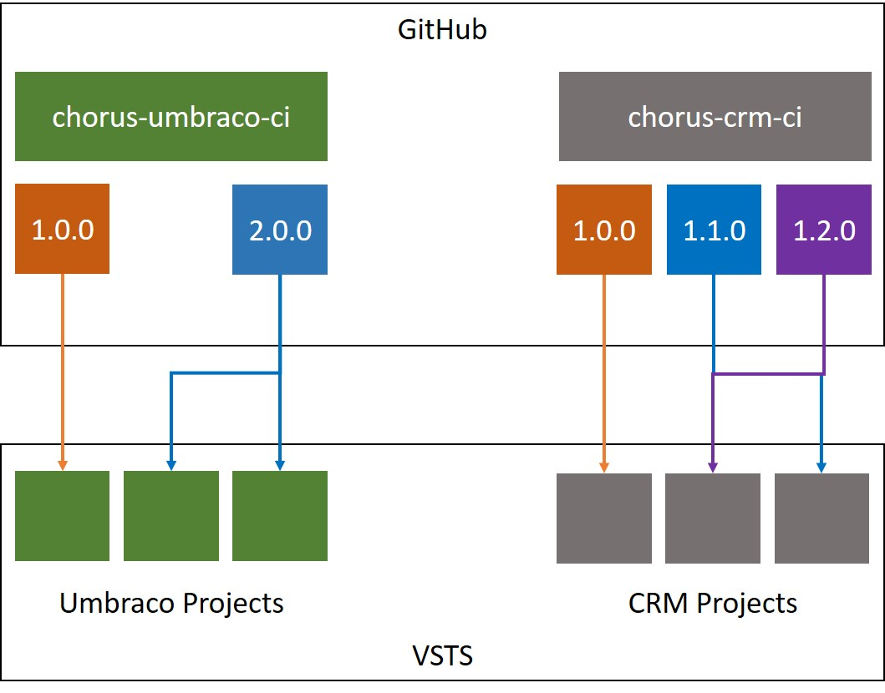

# Overview
Useful info and getting started with YAML CI builds (and releases once available!) for use on Chorus projects.

# Why's this on GitHub?
Currently, the only way of having external templates for VSTS yaml builds is to pull them from another git repo (no packages support, annoyingly).
However, this feature only supports (at time of writing) pulling from a VSTS repo in the same project! As we have many projects, that doesn't work for Chorus, so we're hosting these on github.

They are therefore publically available by necessity, but Chorus do not provide and kind of warranties, gurantees or anything else and reserve the right to take everything back into private VSTS repos in future. It is not our intention to make this software publically available or support it in the community, so use entirely at your own risk (but if it helps you figure out how to improve your own CI/CD, then awesome!)

# Why YAML builds?
YAML builds are the VSTS way of achieving pipleline as code.

This allows us to source control our build processes meaning they get the same feature branch testing, peer review, history etc. as 'normal' application code.

# Templates
A Chorus specific challenge is lots of projects of a similar type. Having each repo code its own build isn't very DRY and projects which are only worked on for occasional fixes risk getting left behind (e.g. as we add more code quality checks, etc.).

As such, the repos in this GitHub organisation provide templates which can be leveraged in all Chorus projects of that type, to make it easy to stay on the latest and greatest.

Parameters can be passed to the templates to make them flexible.

These are the templates we have currently:

| Name                                                                          | Description                         |
| ----------------------------------------------------------------------------- | ----------------------------------- |
| [chorus-umbraco-ci](https://github.com/ChorusSolutions/chorus-umbraco-ci)     | Umbraco projects                    |


## Versioning
Our approach is to make each project opt-in to updates to the standard templates. This is achieved by referencing the templates through a specific git tag when using them in the target project. The architecture looks like this:



# Usage
Note: in future we'll make this easier by adding the YAML build to relevant bootstrappers/templates used internally!

Create a yaml build in your VSTS repo by adding a .vsts-ci.yml file to the root of the repo. When pushed this will automatically create a build (if the user doing the push has permission to do so). If needed, you can manually create the build through the UI and point it at this file.

More detailed info is available from [Microsoft](https://github.com/Microsoft/vsts-agent/blob/master/docs/preview/yamlgettingstarted.md)

## Creating Your Build
It's recommended that you target the template from a specific tag, so that you're not automatically updated to the latest (potentially breaking) changes.

In your .vsts-ci.yml file at the root, populate it like this:

```yaml
queue: Hosted VS2017

resources:
  repositories:
  - repository: umbraco-ci
    type: github
    endpoint: github-endpoint
    name: ChorusSolutions/chorus-umbraco-ci
    ref: refs/tags/<TAG NAME>

steps:

- template: template/umbraco-ci.yml@umbraco-ci
  parameters:
    slnPath: demo/Chorus.UmbracoCI.Demo/Chorus.UmbracoCI.Demo.sln
```

The "resouces:" bit is applicable to all templates (change the repo name as appropriate). The "template:" call is an example using the chorus-umbraco-ci template.
Replace <TAG NAME> with the tag in this GitHub repo you wish to target.

You also need to create a github endpoint in the VSTS project called 'github-endpoint' if there isn't one already.

You can add other steps before/after the template call as needed.

## Gotchas
Currently, authorization for the endpoint doesn't happen very seamlessly. You'll likely get a message complaining about this when you first run your YAML build.

As documented [here](https://github.com/Microsoft/vsts-agent/blob/master/docs/preview/yamlgettingstarted-authz.md#resources) there is a workaround.
- Edit your build from the VSTS UI
- Change the default branch (in the Get sources step) to the feature branch you're trying to get the YAML build working on
- Trigger the build: this should do the authorization
- Change the default branch back (usually to develop)

# Building a template
Please create a GitHub repo in this organisation for your template and add the relevant branch policies as we do for VSTS repos.
Don't forget the readme with your specific params!

Please link back to this repo for instructions on getting started...and add your template to the table to make it quick+easy for people to find!

## Versioning
Please ensure that if you have a new version ready for use it is tagged with a semver release number, as all dependant projects will depend on this to target a specific version (making updates opt in)

## Demo
The templates all have a demo to show an example of it working, as well as testing the build template (add a CI build in VSTS)